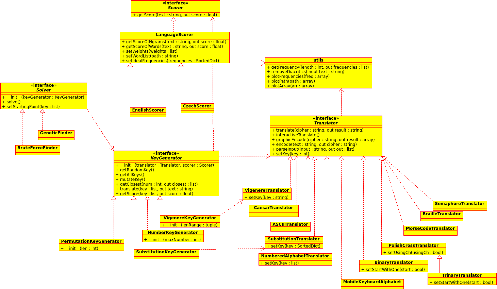

Structure
*********

Class diagram
=============

Pycrypt's overall structure consist of 4 main parts. But first, let's take a look at the UML diagram:

.. _big_diagram: diagram.png

.. warning::

	This diagram is just orientational. The project has evolved, while the diagram did, and probably will, not. 

As you can see, there are 4 interfaces (which, because python doesn't support them, are just uninstantiated classes). These are the 4 basic building blocks for solving a cipher. They are:

* **Translators**

  which enable the basic encoding and decoding of a specific cipher (e.g. a Caesar cipher)
* **KeyGenerators**

  which generate keys for the Translators. They can implement generating all keys (for brute force solving) and mutating a key (for genetic algorithms)
* **Scorers**

  which calculate how *good* the solution is. Typically, you'll want to use them for scoring how close and similar they are to a specific language
* **Solvers**

  which glue everything together. They will get some keys with a KeyGenerator, apply these keys to the cipher with a Translator and finally score these solutions with a Scorer. They will also take care of printing out progress and optional interactions (during the solving process) from the user.

Why are you telling me all this??
=================================

Usually, pycrypt alone won't do too much during a typical cryptographic game. The cipher creators try hard to steer away from the standard ciphers. They'll try to make something creative and something that will require an idea. It would be impossible to cover all of these kinds of ciphers.

Pycrypt was developed with that in mind, and the user was meant to write a little bit of code during the actual solving. The structure of pycrypt is supposed to allow you to write code just for what is needed and take care of everything else (like printing and actual solving algorithms).

Next steps
==========

You can either continue following this tutorial or jump ahead and dive into the API documentation:

.. seealso::
	
	`pycrypt API documentation <pycrypt.html>`_