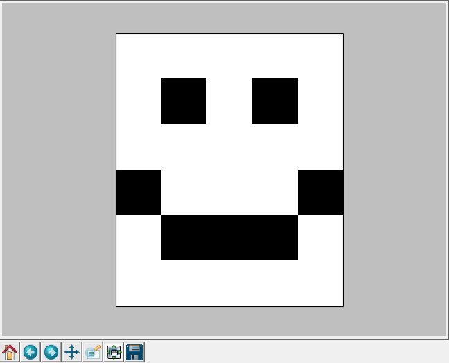

Translators
***********

Translators take care of translating to and from a specific cipher. There are some (over 10) already included in pycrypt.

Basic Usage
===========

Let's take a look at decoding a `Caesar cipher <http://en.wikipedia.org/wiki/Caesar_cipher>`_ with alphabet shift of 1:

.. code-block:: python

	import pycrypt as pc

	t = pc.CaesarTranslator()
	t.setKey(1)
	print t.translate("GDKKN VNQKC!")

Which should output::

	HELLO WORLD!

We have created a Translator, set its key (alphabet shift) to 1 and called the method translate to uncover the secret message.

.. note::
	Since Translators are meant to be used on encrypted text, here the method ``translate`` actually shifted the alphabet by 1 back, not forward. You can also use the method ``decode``, which is just an alias for ``translate`` and is maybe more semantically correct.

We can also revert the process with ``encode``:

.. code-block:: python
	
	>>> t.encode("Hello World!")
	'GDKKN VNQKC!'

And that's about it! But there are some more advanced uses too.

Some translators come with the ``graphicEncode`` method, which returns typically a 2d bool NumPy array that we can then draw with pycrypt's ``plot_array`` function:

.. code-block:: python

	t = pc.MorseCodeTranslator()
	pc.plot_array(t.graphicEncode("SI\nRN\nSI\nNU\nWN\nSI"))

This will draw an image in a new window:

   SI RN SI NU WN SI

In this example, ``MorseCodeTranslator``'s ``graphicEncode`` splits the input in lines and concatenates the Morse code characters, that represent the 1s and 0s (black and white squares). You can alter the functionality with some optional arguments.

You can also play around with the ``interactiveTranslate`` method, which just cyclically takes standard input, so you could see intermediate results.

And that's about all the functionality you can expect from Translators. Easy enough, isn't it?

Making your own Translator
==========================

Before we will extend the Translator interface, we should see its methods from the API:

:mod:`translator` Module
------------------------

.. automodule:: pycrypt.translators.translator
    :members:
    :undoc-members:
    :show-inheritance:

All you have to do when inheriting from ``Translator`` is to implement the ``translate`` method. Optionally, you can implement ``encode`` and maybe even ``graphicEncode``. ``parseInput`` is meant to be just an internal method and implementing it is optional, but pycrypt's standard is to always make the cipher uppercase. For examples, see to `source <_modules/pycrypt/translators/caesartranslator.html>`_ of `some <_modules/pycrypt/translators/morsecodetranslator.html>`_ implementations.

Further reading
===============
To check out all Translators, see the API

.. seealso::
	
	`Translators <pycrypt.translators.html>`_
