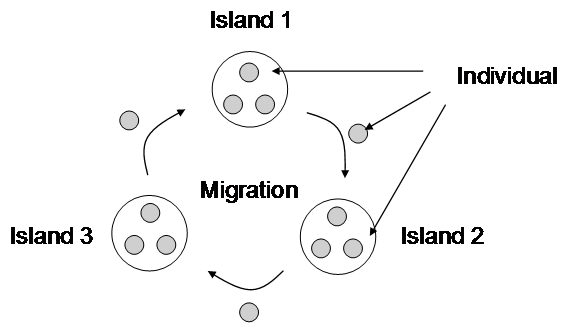
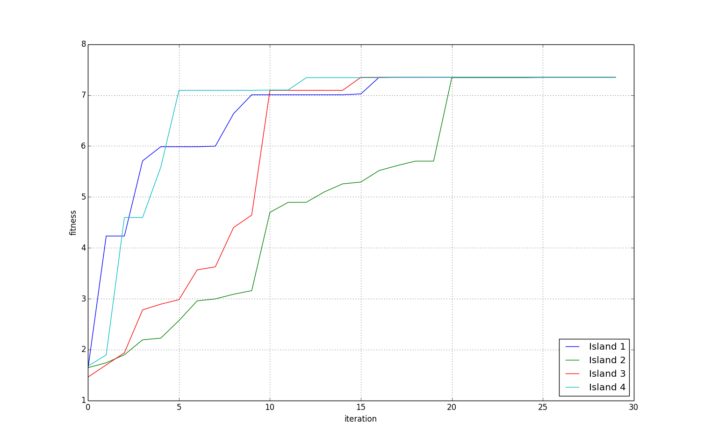
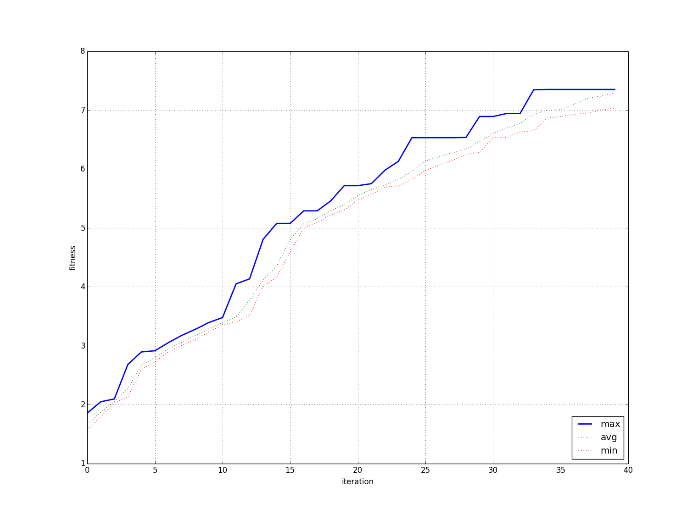

What's new in v0.2
******************

Apart from some bug fixes and improvements, version 0.2 of pycrypt came with some new features. Let's break them down:

The island model
================

The biggest improvement in pycrypt is that it's now multi-threaded. It can now eat up all your processing power and is about 4 (or equivalent to your number of cores) times faster.

The new ``ThreadedGeneticSolver`` has the same interface as ``GeneticSolver``, but runs as many instances of ``GeneticSolver`` as you have cores (you can change that with the ``num_processes`` argument). They don't just run separated though, every 10 iterations (set by ``migration_iterations``) the "islands" exchange their best individuals in a cyclic pattern.

This strategy makes it a lot better, mainly because the evolution doesn't get stuck in local maxima as much now. If we look at a plot of an evolution with ``ThreadedGeneticSolver``:

Even though island 2 got behind, the other islands helped it get back up to speed on iteration 20 (migrations occur on every tenth iteration).

.. warning::
    The interactive interruption of ``ThreadedGeneticSolver`` doesn't work so well. On different OSes happen different problems, the safest bet is just to set the iteration max and wait for the evolution to actually finish.

This brings us to another feature:

Evolution plotting
==================

Both ``ThreadedGeneticSolver`` and ``GeneticSolver`` now support the ``plotLog`` method, you just need to enable logging with ``log=True``. Let's take a look at ``GeneticSolver`` plot:

This proved to be very helpful during development, as it revealed some quirks the algorithms had.

Crossovers
==========

Initially, pycrypt didn't include crossovers in its genetic algorithms. That was because permutations (which are used as keys for substitution ciphers) aren't easily crossed over. Inspired by the algorithm described `here <http://www.cs.colostate.edu/~genitor/1995/permutations.pdf>`_ (the order crossover 1), along with some standard algorithms as 1 and 2 point crossovers and tournament selection, they are now implemented.

I think that this added some not insignificant boost, but it's not easily measured.

Temperature scaling
===================

Another experimental feature, which is based on cooling down the mutations as the fitness gets better. It works a bit different in pycrypt - with high temperature, the most frequent letters like 'E', 'T' and 'A' get switched. As the evolution progresses, less frequent letters get switched, so that the finishing touches on the solution are made.

This approach didn't prove very useful though, so I turned it off by default. I think it is because he biggest problems are local maxima and they don't necessarily have the infrequent letters wrong, so the evolution gets stuck even more.

Cached scoring
==============

The scoring is the performance bottleneck of pycrypt. All scoring is now cached, so if you score an individual twice, the score gets computed only once. This is managed by the ``cache`` decorator in the ``utils`` module and it can be applied to any function or method you want.

Easier installation
===================

Pycrypt is now structured as a legit python package with requirements done finally right, so you can install it quickly with:

.. code-block:: bash

    $ pip install "git+https://github.com/PrehistoricTeam/pycrypt.git@master#egg=pycrypt"

I might even consider getting pycrypt on PyPI in the near future.